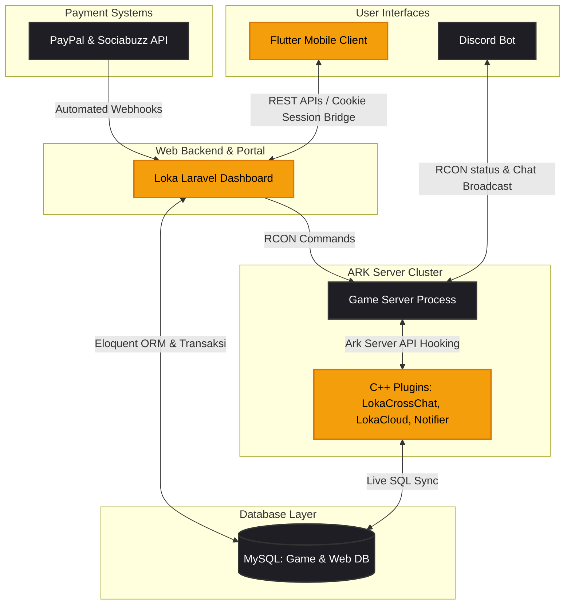

# Hi there, I'm Irvan Prastyo 👋

  

I specialize in building end-to-end ecosystems for high-traffic game servers, with a deep focus on **ARK: Survival Evolved (ASE)** and **ARK: Survival Ascended (ASA)**. My work spans low-level game engine hooking in C++, high-performance companion mobile apps (Flutter), robust web administration portals (Laravel), automation bots (Node.js), and asset extraction pipelines (Python).

---

### 🌐 Live Ecosystem Status

---

### 🏛️ System Architecture

Here is how the components of the game server ecosystem communicate and synchronize data:

---

### 🛠️ Languages & Technologies

<table>
  <tr>
    <td align="center" width="110">
      
       C++
    </td>
    <td align="center" width="110">
      
       PHP
    </td>
    <td align="center" width="110">
      
       Dart
    </td>
    <td align="center" width="110">
      
       JavaScript
    </td>
    <td align="center" width="110">
      
       Python
    </td>
    <td align="center" width="110">
      
       Batch / Cmd
    </td>
  </tr>
  <tr>
    <td align="center" width="110">
      
       Laravel
    </td>
    <td align="center" width="110">
      
       Flutter
    </td>
    <td align="center" width="110">
      
       Node.js
    </td>
    <td align="center" width="110">
      
       MySQL
    </td>
    <td align="center" width="110">
      
       Tailwind / DaisyUI
    </td>
    <td align="center" width="110">
      
       Git
    </td>
  </tr>
</table>

*   **Core Languages:** C++, PHP, Dart, JavaScript (Node.js), Python, SQL, Windows Batch Scripting (`.bat` / `.cmd`)
*   **Web Frameworks & Libraries:** Laravel (MVC), Tailwind CSS v4, DaisyUI, Leaflet.js (Interactive Maps), Blade Templating, Vite
*   **Mobile Technologies:** Flutter SDK, Android SDK, WebView (with Session/Cookie Injector)
*   **Protocols & APIs:** RCON Protocol (Game Server Remote Execution), Steam OpenID / Web API, PayPal Checkout SDK, Sociabuzz Payment Gateway Webhooks
*   **Game Engine Integration:** Ark Server API (C++ Hooking), Unreal Engine Asset Extractor (uasset serialization & schema parsing)
*   **Dev Tools & Environments:** Visual Studio (MSBuild), VS Code, npm, Composer, Git/GitHub, Ark Server Manager (ASM)

---

### 📂 Highlighted Projects

#### 🎮 [Loka Laravel Dashboard](https://github.com/vertex-pan/loka-laravel-dashboard) (Web Ecosystem Portal)
*A high-end player web portal and automated billing system for game server clusters.*
*   **Tech Stack:** PHP (Laravel), Tailwind CSS & DaisyUI, Vite, JavaScript, MySQL, Steam OpenID
*   **Key Features:**
    *   **Secure Steam Integration:** Direct authentication using Steam ID 64 with automatic database profiling linked to live game characters.
    *   **Automated Payment Gateways:** Dual checkout integration featuring **Sociabuzz** (for local Indonesian payment channels: QRIS, GoPay, OVO, DANA, Virtual Accounts) and **PayPal** (for international credit cards). Features automated webhook processing with SQL locking to manage timed VIP tier stacking.
    *   **Item Store & Cloud Delivery:** Custom-built shop `/shop` querying live databases. Purchases automatically generate RCON item delivery queues (extracting blueprint paths, parameters, and count) dispatched directly to active servers.
    *   **Server Monitoring:** Live Leaflet.js interactive maps, real-time online player counters, and server status cards caching query ports asynchronously.
    *   **Admin Impersonation:** Secure Signed URL-based bypass login allowing server admins to audit dashboard interactions from any player's perspective.

#### 📱 [LokaGamers Mobile Client](https://github.com/vertex-pan/LokaGamers) (Cross-Platform Mobile App)
*A dedicated mobile application companion for players to manage their characters and track servers.*
*   **Tech Stack:** Dart, Flutter SDK, WebViewCookieManager, Shared Preferences
*   **Key Features:**
    *   **WebView Cookie Bridge:** Native login screen saving session cookies locally. It uses `WebViewCookieManager` to inject active sessions into embedded WebViews (Live Map & Leaderboards) to bypass web re-authentication.
    *   **In-App Game Utilities:** Native screens for autocomplete Wild Dino Finder (with daily query quotas), live multi-server Tribe Log viewer with keyword filtering, and Server Status cards.
    *   **Remote RCON Execution:** Interactive commands allowing players to trigger actions like instant "Kill Me" to unstuck characters from their mobile device.
    *   **Mobile Item Shop:** Full native UI catalog for store items, purchase checkout, and cloud inventory management to send stored items instantly to in-game characters.

#### 🧩 C++ Server Plugins (Ark Server API Hooking)
*Low-level, high-performance C++ DLLs hooking into the server executable to inject custom logic.*
*   **LokaCrossChat:** Hooks into server chat events to synchronize chat messages across multiple game servers in the cluster in real time.
*   **LokaCloud:** Custom server database synchronizer storing player inventory data safely into external MySQL servers.
*   **Notifier-Loka-System:** Detects in-game world events (e.g., Space Biome changes, Dino spawn events, Extinction cycles) and uses webhooks to broadcast them to external networks.
*   **LokaPVPZone & LokaRoyaleZone:** Dynamic arena zone management adjusting actor damage multipliers and boundary logic.

#### 🤖 ARK-Loka-BOT (Discord Automation)
*A custom Node.js bot for Discord automation and server monitoring.*
*   **Tech Stack:** JavaScript, Node.js, Discord.js, RCON Client
*   **Key Features:**
    *   Real-time server stats reporting, role synchronization based on VIP purchases, and automated RCON command executors for moderators.

---

### 📈 GitHub Stats

  
  

---

*“Bridging the gap between low-level game engines and modern web/mobile experiences.”*  
📬 Feel free to connect with me if you're interested in server backend integrations, C++ game plugins, or custom gaming companion apps!
